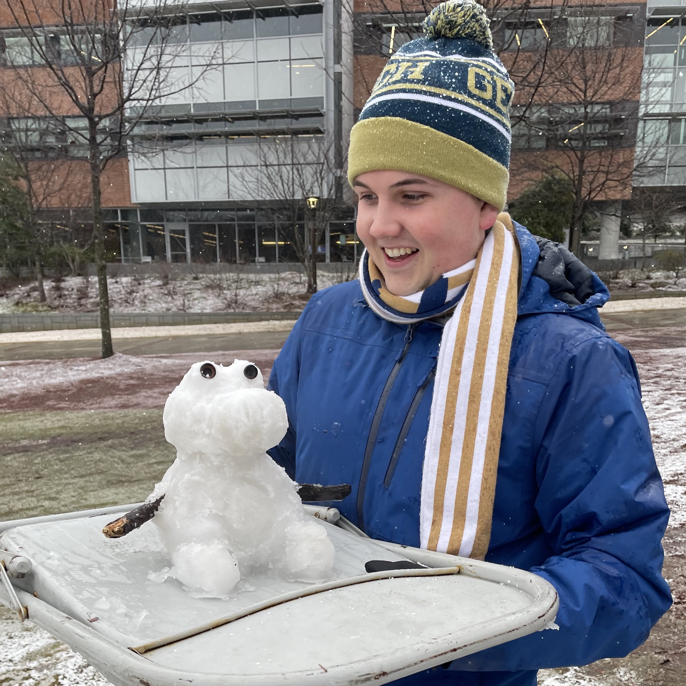

# Hello! :)

I'm an undergraduate Computer Science student at Georgia Tech and an aspiring Computational Social Scientist. I want to investigate the cultural impacts of online social systems, and find ways to build technologies that facilitate healthy individual experiences and a healthy world.

I do research at the <a href="https://socweb.cc.gatech.edu/">Social Dynamics and Wellbeing Lab</a> under <a href="http://www.munmund.net/index.html/">Professor Munmun De Choudhury</a>. Currently, I'm exploring disparities in mental health narratives using search engine data.

### Background
I've been a Software Engineering Intern at Pegasystems and Shentel in the past. When I'm not in Atlanta, I call historic Williamsburg Virgnia my home. I play flute, piano, percussion, and produce electronic music. I am an Eagle Scout, and a leader on campus in Marching Band and at The Wesley Foundation.

### Links + Contact
<a href="https://www.linkedin.com/in/ben-rochford/">LinkedIn</a>

`brochford3 at gatech dot edu`
